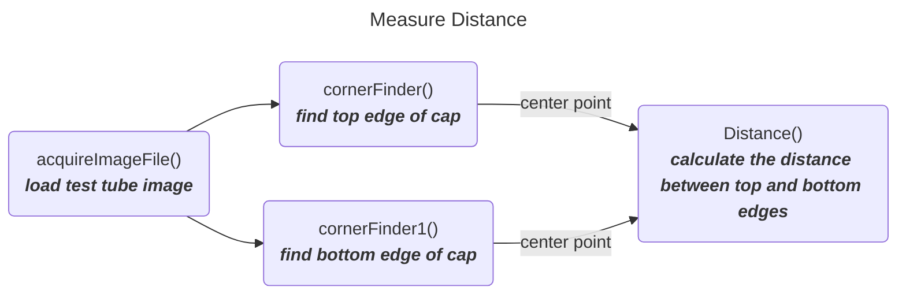

# Page 4

```mermaid
---
title: Measure Distance
---
graph LR
    A("`acquireImageFile()
        _**load test tube image**_`")
    B("`cornerFinder1()
        _**find bottom edge of cap**_`")
    C("`cornerFinder()
        _**find top edge of cap**_`")
    D("`Distance()
        _**calculate the distance between top and bottom edges**_`")

    A --> C
    A --> B
    C -->|center point| D
    B -->|center point| D
```
