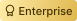
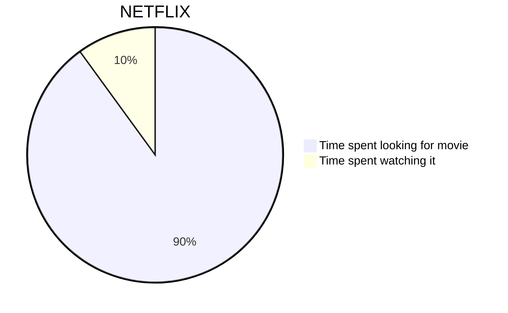

# Page 5



### This is a H2 heading

This is a line

This is an inline  image &#x20;

* This is a second <mark style="color:orange;background-color:purple;">line using an unordered list and color</mark>



### This is a H2 heading

This is a line

This is an inline  image

* This is a second <mark style="color:orange;background-color:purple;">line using an unordered list and color</mark>


### Representation in Markdown



### This is a h2

this  is an incline image

this  is an incline image


this .png>) is an inline image too

so is this  incline image

hello world 

